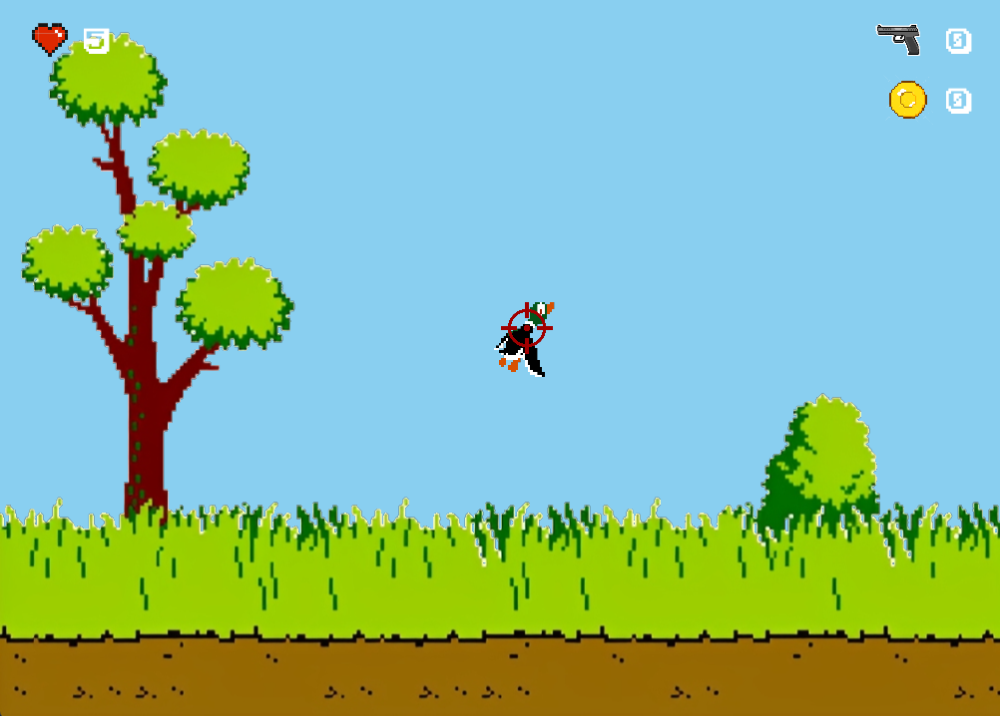

# 🦆 Projet Python Arcade -  Duck Hunt

Un petit jeu de tir inspiré du classique Duck Hunt, développé en Python avec le moteur Arcade.



## 🎮 Fonctionnalités

- Apparition aléatoire de canards
- Tir à la souris
- Interface simple et rétro
- Animations avec spritesheets déssinées sur [Piskel](https://www.piskelapp.com/)
- 

## 🛠️ Installation

### 1. Clone le dépôt :
```bash
  git clone https://github.com/alexandrebrgn/python_duck_hunt.git
  cd python_duck_hunt
```
### 2. Installer les dépendances :
```bash
   pip install -r requirements.txt
```
_Installer le package python arcade_
## 🚀 Lancer le jeu 
```bash
  python main.py
```

## 🥀 Améliorations possibles
- Implémenter une __limite de tir__ ratés avec cooldown entre chaque balle ratée
- Implémenter **l'achat** de plusieurs améliorations :
  - Réduction cooldown entre tirs
  - Elargissement de la zone d'impact 
  - Ralentissement de la vitesse des canards
- **Ecran de fin de partie** avec le chien qui se moque du joueur
- **Classement** stocké dans cloud
